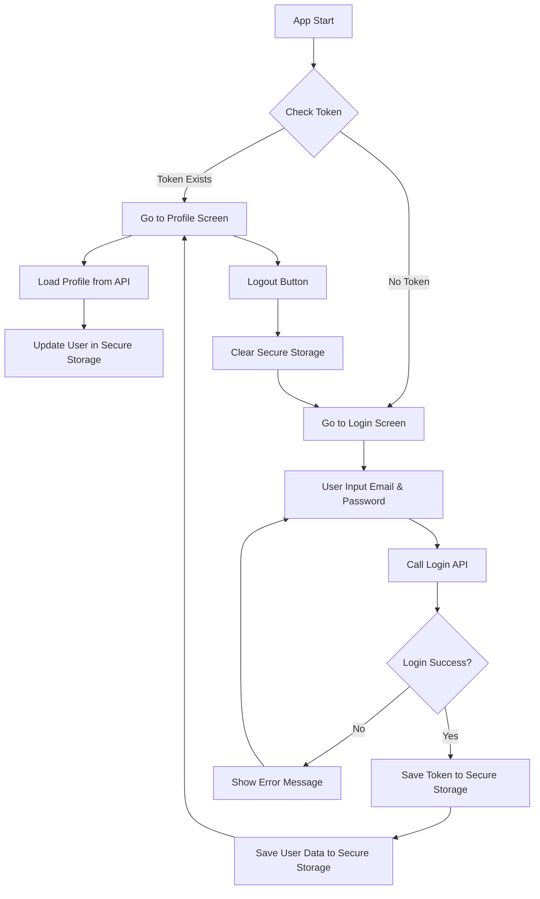
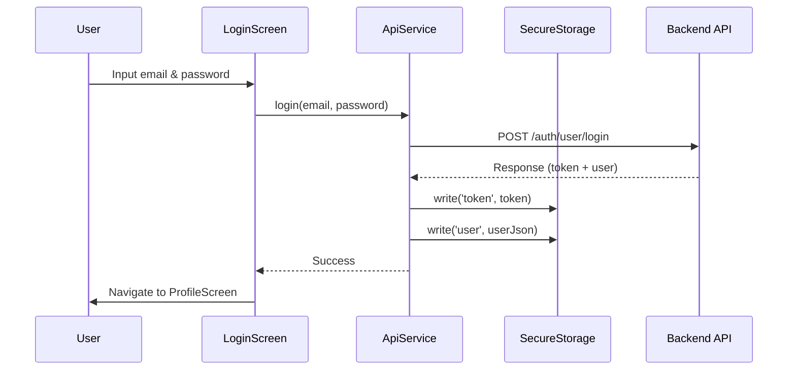
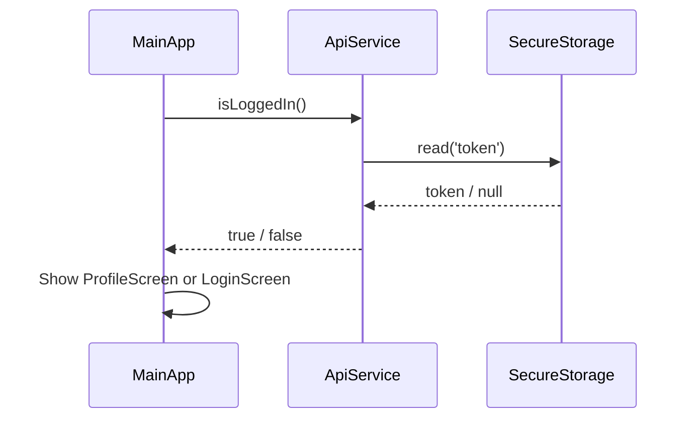
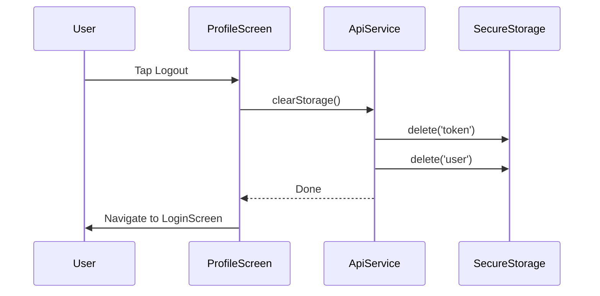

# Flutter Secure Storage - Flow Logic

## 📦 Instalasi

```yaml
# pubspec.yaml
dependencies:
  flutter_secure_storage: ^9.2.4
```

> [!IMPORTANT]
> Untuk Android, pastikan `minSdk = 23` di `android/app/build.gradle.kts`

---

## 🔄 Flow Diagram



---

## 🔐 API Service Methods

### 1. Inisialisasi Storage

```dart
final FlutterSecureStorage _secureStorage = const FlutterSecureStorage();
```

### 2. Save Token

```dart
Future<void> saveToken(String token) async {
  await _secureStorage.write(key: 'token', value: token);
}
```

### 3. Get Token

```dart
Future<String?> getToken() async {
  return await _secureStorage.read(key: 'token');
}
```

### 4. Save User Data

```dart
Future<void> saveUser(User user) async {
  await _secureStorage.write(
    key: 'user',
    value: jsonEncode(user.toJson())
  );
}
```

### 5. Get User Data

```dart
Future<User?> getStoredUser() async {
  final userJson = await _secureStorage.read(key: 'user');
  if (userJson != null) {
    return User.fromJson(jsonDecode(userJson));
  }
  return null;
}
```

### 6. Clear Storage (Logout)

```dart
Future<void> clearStorage() async {
  await _secureStorage.delete(key: 'token');
  await _secureStorage.delete(key: 'user');
}
```

---

## 📱 Flow per Screen

### Login Flow



### Auth Check Flow (App Start)



### Logout Flow



---

## 🔒 Keamanan

| Platform    | Encryption Method                              |
| ----------- | ---------------------------------------------- |
| **Android** | EncryptedSharedPreferences (AES-256)           |
| **iOS**     | Keychain Services                              |
| **Web**     | sessionStorage / localStorage (⚠️ less secure) |
| **Windows** | Windows Credential Manager                     |
| **macOS**   | Keychain                                       |
| **Linux**   | libsecret                                      |

---

## ⚠️ Common Issues

### 1. Stuck di Loading (Android)

**Penyebab:** minSdk terlalu rendah  
**Solusi:** Set `minSdk = 23` di `build.gradle.kts`

### 2. Data Lama Masih Ada

**Penyebab:** Cache dari shared_preferences sebelumnya  
**Solusi:** Uninstall app lama, install ulang

### 3. Error "PlatformException"

**Penyebab:** Emulator tidak support secure storage  
**Solusi:** Gunakan device fisik atau emulator dengan API 23+
